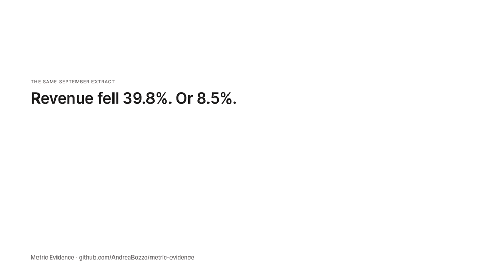
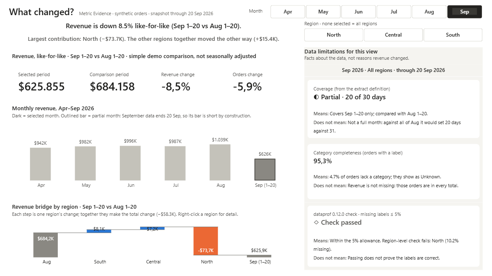
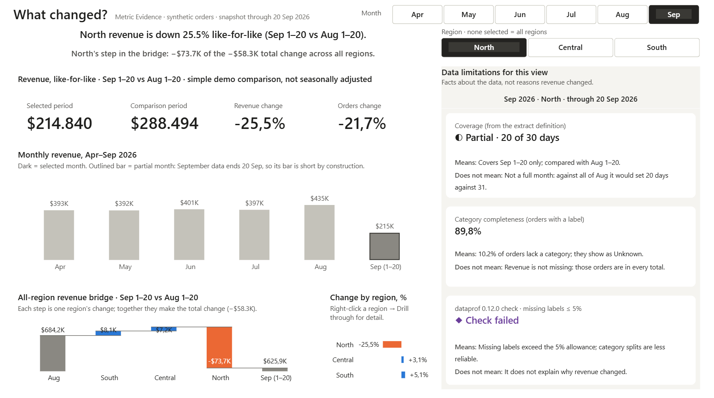
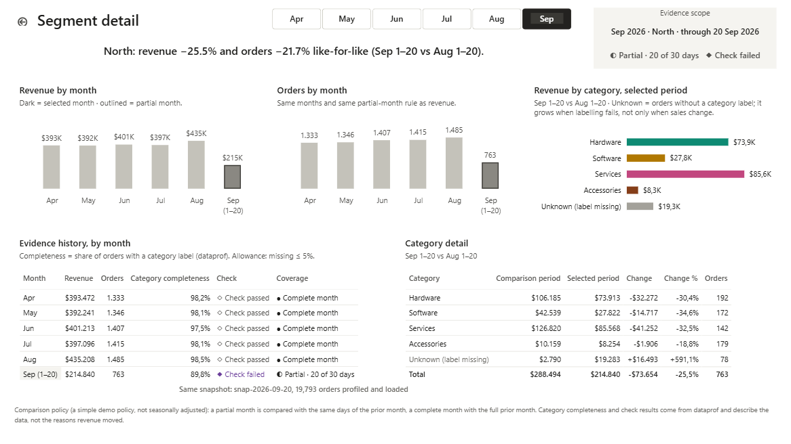

# Metric Evidence

**Revenue changed. Which segments contributed, and what data limitations affect the interpretation?**

A local Power BI report that puts each business metric next to evidence about
the data behind it: [dataprof](https://github.com/AndreaBozzo/dataprof)
profiles per month and region, the snapshot's coverage, and a check that the
orders Power BI loaded are the rows dataprof profiled. Data observations describe the data; they are never
presented as reasons revenue moved. Synthetic data, no Power BI Service, no
Fabric, no paid licence.

[](docs/media/metric-evidence-15s.mp4)

<sub>15-second walkthrough ([MP4, 1080p](docs/media/metric-evidence-15s.mp4)), animated in Figma from the report captures.</sub>



| North selected: the failed check sits beside the decline, in its own colour | Right-click North → Drill through: volume, categories, evidence history |
|---|---|
|  |  |

## Run it (Windows)

Needs Power BI Desktop (tested 2.158, Sep 2026), Python 3.12 and
[uv](https://docs.astral.sh/uv/).

```powershell
uv sync                                   # dataprof==0.12.0, pytest, jsonschema, pythonnet
uv run python prep/generate_orders.py     # data/orders.csv + manifest.json + dimensions
uv run python prep/build_evidence.py      # dataprof evidence tables + native JSON
uv run python prep/reference.py           # independent reference results (integer cents)
uv run pytest -q
```

Open `powerbi\MetricEvidence.pbip` in Desktop and select **Refresh** (a PBIP
stores no data). If the repo is not at `C:\dev\pbi-dq`, change the
`DataFolder` parameter (**Transform data → Edit parameters**); it is the only
machine path in the project. Python steps take `--data-dir` or
`METRIC_EVIDENCE_DATA_DIR`.

With the report open:

```powershell
uv run python prep/reconcile_live.py          # read-only DAX vs the Python reference
uv run python prep/snapshot_mutation_check.py # alters one value at a time, expects "Mismatch", restores
```

Drill through by right-clicking a region in **Change by region, %** (waterfall
breakdown steps do not offer drillthrough). The detail page receives only the
region; the month comes through the synced month slicer, so it can be changed
there too.

## What is in the data

19,793 orders, Apr–Sep 2026, three regions, four categories plus an explicit
*Unknown*. Three planted situations, recorded in `data/manifest.json`:

1. North takes 20% fewer orders per day in September (a real business change).
2. North's September orders lose their category label 11% of the time
   (2% elsewhere). Their revenue stays in every total, under *Unknown*.
3. The extract stops at 20 September.

A partial month is compared with the same days of the previous month
(Sep 1–20 vs Aug 1–20: −8.5%); a naive full-month comparison would claim
−39.8%. Complete months compare full months. This is a demo policy, not a
seasonally adjusted analysis.

## How the evidence works

| Table | Source | Grain |
|---|---|---|
| `evidence_column_stats` | dataprof column profiles (full scans) | scope × column |
| `evidence_checks` | dataprof `check()`: category nulls ≤ 5%, other columns no nulls, no duplicate rows | scope × check |
| `month_coverage` | generation manifest + Python cutoff check | month |
| `snapshot` | snapshot id, cutoff, orders sha256, row count, revenue total, per-column checksums | one row |

A scope is the snapshot, a month, or a month × region. Each evidence measure
picks exactly one scope, so overlapping profiles are never added together, and
null shares come from counts, never from averaged percentages. A check dataprof
could not evaluate stays *not evaluated*. Evidence supports one month with all
regions or one region; anything else reads *Evidence unavailable for this
selection*. Category filters cannot reach the evidence.

*Loaded orders match the profiled snapshot* means: one snapshot id across the
evidence tables, and the row count, revenue total and four order-weighted
checksums (revenue, date, category, region) recomputed from the loaded orders
equal the values written when dataprof profiled them. Any single changed value
or missing row breaks the match (`snapshot_mutation_check.py` proves it). The
checksums detect divergence, not deliberate tampering.

## Repository

| Path | |
|---|---|
| `prep/` | generator, dataprof adapter, reference, live reconciliation, PBIR validator, report authoring script |
| `powerbi/` | the PBIP: TMDL model (8 tables, every measure described) and PBIR report, theme |
| `data/` | generated inputs and `reference_results.json` |
| `verification/` | what was verified and how ([record](verification/README.md)) |
| `docs/` | [design spec](docs/design-spec.md), [enhancement notes](docs/enhancement-notes.md), phone-sized panels in `docs/img/social/`, the walkthrough clip in `docs/media/` |

`prep/author_report.py` generated the report pages. After editing in Desktop,
the PBIR files are the source of truth and the script refuses to overwrite
them without `--overwrite`.

The [Power BI Authoring MCP](https://github.com/microsoft/powerbi-modeling-mcp)
is configured in `.mcp.json` (pinned to 1.0.0) for agent sessions. It was used
to inspect the model (relationships, measure descriptions) and run validation
queries; the model was written as TMDL and the report pages by
`prep/author_report.py`, not by the MCP.

## Limitations

* Synthetic data with planted effects: the numbers illustrate the method only.
* One snapshot. The monthly evidence history comes from profiling generated
  slices; dataprof does not store history or detect drift by itself.
* Coverage is the generator's own statement of the extract. Real pipelines need
  an independent record of expected periods.
* Evidence is month-grain; two-region selections are not supported.
* The global `quality_score` is deliberately unused: one number does not show
  whether revenue is right.
* Long sentences use the legacy card visual (centred) because no card visual in
  Desktop 2.158 wraps a measure's text.

## License

Either the [MIT License](LICENSE) or the [Apache License, Version 2.0](LICENSE-APACHE), at your option.
